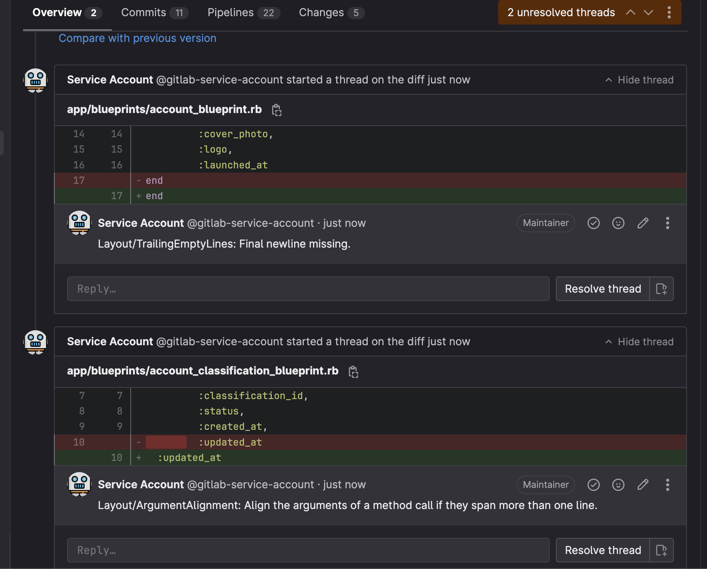

# GitLab Code Reviewer

Introducing a RubyGem that automates GitLab discussions for code offenses and issues. It provides key details like line numbers and error/warning messages, streamlining the process for reviewers and fostering better collaboration. Simplify code reviews with this powerful addition to GitLab projects!



##### Supports:

- [x] Rubocop
- [ ] Brakeman
- [ ] ERB lint

## Installation

Add this line to your application's Gemfile:

```ruby
gem 'gitlab_code_reviewer', group: 'test'
```

And then execute:

    $ bundle install

Or install it yourself as:

    $ gem install gitlab_code_reviewer

## Usage

For rubocop:

1. Make sure your rubocop command passes proper format arguments:

```yaml
# gitlab-ci.yaml
...
rubocop:
  stage: test
  ...
  before_script:
    - gem install gitlab_code_reviewer
  script:
    - bundle exec rubocop --format progress --format json --out rubocop.json
  after_script:
    - bundle exec start_rubocop_review --file=rubocop.json
...
```

## Development

After checking out the repo, run `bin/setup` to install dependencies. Then, run `rake spec` to run the tests. You can also run `bin/console` for an interactive prompt that will allow you to experiment.

To install this gem onto your local machine, run `bundle exec rake install`. To release a new version, update the version number in `version.rb`, and then run `bundle exec rake release`, which will create a git tag for the version, push git commits and the created tag, and push the `.gem` file to [rubygems.org](https://rubygems.org).

## Contributing

Bug reports and pull requests are welcome on GitHub at https://github.com/[USERNAME]/gitlab_code_reviewer. This project is intended to be a safe, welcoming space for collaboration, and contributors are expected to adhere to the [code of conduct](https://github.com/[USERNAME]/gitlab_code_reviewer/blob/main/CODE_OF_CONDUCT.md).

## License

The gem is available as open source under the terms of the [MIT License](https://opensource.org/licenses/MIT).

## Code of Conduct

Everyone interacting in the GitlabCodeReviewer project's codebases, issue trackers, chat rooms and mailing lists is expected to follow the [code of conduct](https://github.com/[USERNAME]/gitlab_code_reviewer/blob/main/CODE_OF_CONDUCT.md).
